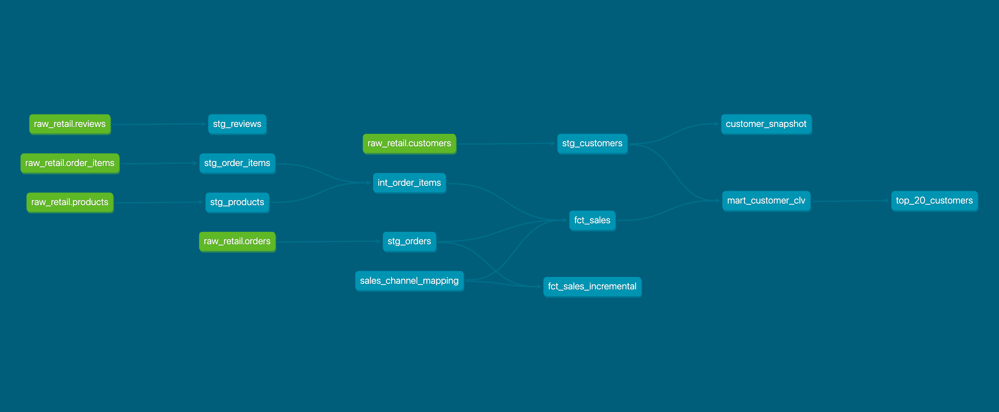
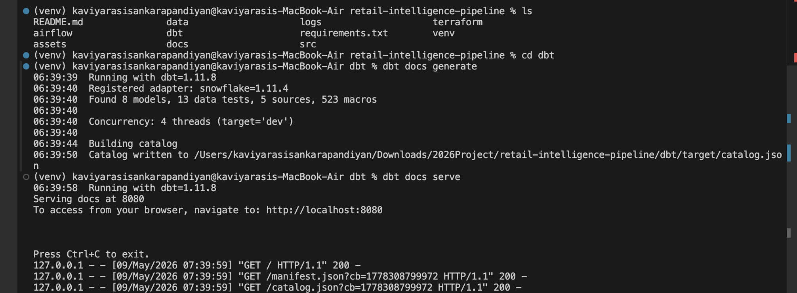
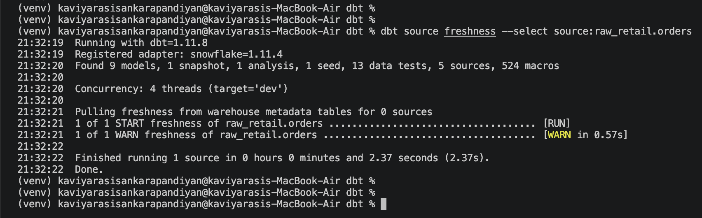
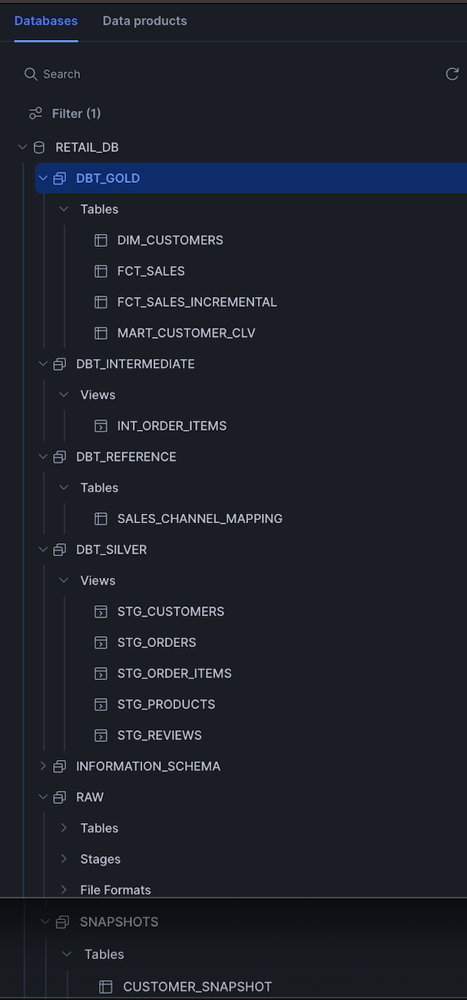
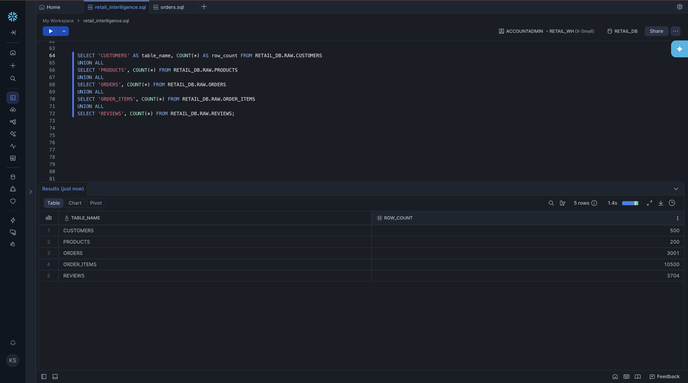
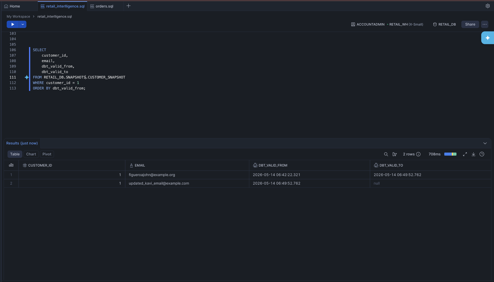
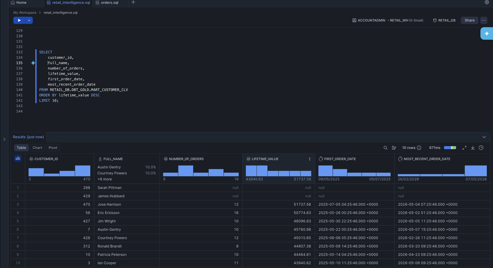
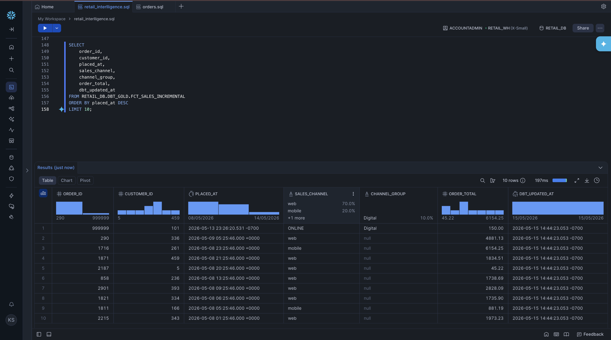

# Retail Intelligence Pipeline with Snowflake and dbt

This project is a retail analytics data warehouse built using Snowflake and dbt.

The goal of this project is to load raw retail data into Snowflake, transform it using dbt, apply data quality checks and create business-ready tables for analytics.

## Project Overview

This project uses synthetic retail data such as customers, products, orders, order items and reviews.

### The pipeline follows this flow:

    CSV files -> Snowflake RAW tables -> dbt staging models -> dbt intermediate models -> dbt gold marts

### The project includes:

- Snowflake raw data loading
- dbt staging, intermediate, and gold models
- dbt data quality tests
- dbt incremental model
- dbt snapshot for SCD Type 2 history tracking
- dbt seed for reference data
- dbt macro for reusable SQL logic
- dbt source freshness check
- dbt documentation and lineage graph

### Total Stack

- Snowflake
- dbt Core
- Python
- SQL
- Git and GitHub

### Project Architecture

This project follows a Medallion Architecture pattern.

    RAW -> SILVER -> INTERMEDIATE -> GOLD

### RAW Layer

The RAW layer stores source data as loaded from CSV files.

#### Tables:

- RAW.CUSTOMERS
- RAW.PRODUCTS
- RAW.ORDERS
- RAW.ORDER_ITEMS
- RAW.REVIEWS

### SILVER Layer

The Silver layer contains cleaned staging models created by dbt.

#### This layer is used for:

- renaming columns
- standardizing fields
- preparing data for downstream models

#### Schema:

    DBT_SILVER

### INTERMEDIATE Layer

The intermediate layer contains reusable transformation logic.

#### Schema:

    DBT_INTERMEDIATE

### GOLD Layer

The Gold layer contains business-ready tables for reporting and analytics.

#### Schema:

    DBT_GOLD

#### Gold models include:

- FCT_SALES
- FCT_SALES_INCREMENTAL
- MART_CUSTOMER_CLV

## Current Validation Status

### Local Data Generation

Generated synthetic retail datasets:

| Dataset     | Row Count |
| ----------- | --------: |
| customers   |       500 |
| products    |       200 |
| orders      |     3,000 |
| order_items |    10,500 |
| reviews     |     3,704 |

### Snowflake Raw Layer Validation

Manual upload through SnowSight completed successfully.

| Raw Table       | Row Count |
| --------------- | --------: |
| RAW.CUSTOMERS   |       500 |
| RAW.PRODUCTS    |       200 |
| RAW.ORDERS      |     3,000 |
| RAW.ORDER_ITEMS |    10,500 |
| RAW.REVIEWS     |     3,704 |

### dbt Validation Status

The dbt layer has been implemented and validated successfully.

| Area         | Result                             |
| ------------ | ---------------------------------- |
| Sources      | 5 raw Snowflake sources configured |
| Models       | 8 dbt models built                 |
| Staging      | 5 Silver views                     |
| Intermediate | 1 intermediate view                |
| Marts        | 2 Gold tables                      |
| Tests        | 13 data quality tests passed       |
| dbt Docs     | Generated successfully             |

### dbt Layers

| Layer        | Snowflake Schema | Materialization |
| ------------ | ---------------- | --------------- |
| Silver       | DBT_SILVER       | Views           |
| Intermediate | DBT_INTERMEDIATE | Views           |
| Gold         | DBT_GOLD         | Tables          |

## dbt Features Used

### Models

dbt models are used to transform raw Snowflake tables into cleaned and business-ready tables.

### Tests

dbt tests are used to check data quality.

#### Examples:

- `not_null` test on primary keys
- `unique` test on IDs
- `relationships` test between orders, customers and products

### Incremental Model

The project includes an incremental model:

    FCT_SALES_INCREMENTAL

This model is used to process only new records after the first full load.

### Snapshot

The project includes a dbt snapshot:

    CUSTOMER_SNAPSHOT

This tracks customer changes over time using SCD Type 2 logic.

For example, when a customer email changes, dbt keeps the old record and creates a new active record.

### Seed

The project includes a seed file:

    sales_channel_mapping.csv

This is used as reference data to enrich sales channel information.

### Macro

The project includes a reusable macro:

    safe_divide

This helps avoid divide-by-zero errors in business metric calculations.

### Source Freshness

Source freshness is configured on:

    RAW.ORDERS

It uses `order_ts` to check whether the source data is fresh.

The freshness check:

- warns when data is older than 24 hours
- errors when data is older than 48 hours

## Screenshots

### dbt Lineage Graph



### dbt Test Results



### dbt Source Freshness Result



### Snowflake Schema Structure



### Snowflake RAW Table Counts



### SCD Type 2 Snapshot History



### Customer CSV Mart Preview



### Incremental Sales Model Preview



## dbt Documentation Backup

Generated dbt documentation artifacts are stored in:

    docs_backup/dbt_docs/

This includes:

- index.html
- manifest.json
- catalog.json

These files preserve the dbt documentation and lineage metadata after the snowflake trial expired.

## Project Structure

```text
retail-intelligence-pipeline/
├── data/
│   └── landing/
├── dbt/
│   ├── analyses/
│   ├── macros/
│   ├── models/
│   │   ├── staging/
│   │   ├── intermediate/
│   │   └── marts/
│   ├── seeds/
│   └── snapshots/
├── docs/
│   ├── screenshots/
│   └── validation/
├── docs_backup/
├── src/
└── requirements.txt
```

## Future Improvements

Planned future improvements:

- Add Airflow Orchestration
- Add automated ingestion pipeline
- Add dashboard reporting layer
- Add CI/CD for dbt checks
- Add PostgreSQL local development version
- Add real-time streaming simulation using Kafka
